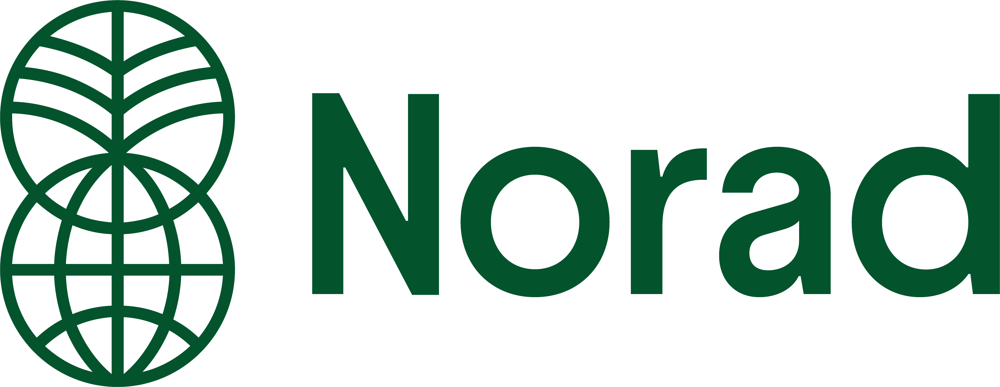

  

<i>The Norwegian Agency for Development Cooperation</i>

  
  
  

 
Norad is the Norwegian Agency for Development Cooperation. We function as an administrative and specialist body supporting the Ministry of Foreign Affairs and the Ministry of Climate and the Environment. Our work is grounded in achieving Norwegian development policy goals, promoting sustainable development, and is guided by the UN's Sustainable Development Goals (SDGs), climate goals, and human rights. We are based in Oslo and have around 320 dedicated employees.

## Our focus: Digitalization for development

We believe that digital solutions are powerful catalysts for social, economic, and democratic progress globally. A key part of Norwegian development aid focuses on:

* Protecting private data and freedom of expression.
* Upholding human rights in the digital sphere.
* Ensuring access to fundamental social services digitally.

We champion **Digital Public Goods (DPGs)** – open-source software, data, AI systems, and content – and **Digital Public Infrastructure (DPI)** as vital tools for digital transformation, especially when implemented safely and sustainably.

Why? Because billions still lack internet access or digital identification, hindering access to essential services. Well-implemented DPGs and DPI can:

* Foster efficient, inclusive systems.
* Drive innovation in public and private sectors.
* Increase equality and protect individual rights (e.g., access to education, healthcare, finance).
* Contribute significantly to economic growth and achieving the SDGs.

Norway, alongside partners like the [Digital Public Goods Alliance (DPGA)](https://www.digitalpublicgoods.net/map) (which we co-founded), [UNICEF](https://www.unicef.no/), and [UNDP](https://www.undp.org/), plays a leading role in promoting DPGs and DPI. We have supported key initiatives like [DHIS2](https://dhis2.org/), the [Global Digital Library](https://digitallibrary.io/), [MOSIP](https://www.mosip.io/), [OpenCRVS](https://www.opencrvs.org/), and are part of the [50-in-5 campaign](https://50in5.net/).

## Our open source repositories

The repositories you find here are part of our commitment to transparency and collaboration. All public repositories are considered open source.

Some examples of our work include:
* **[global_public_goods](https://github.com/noradno/global_public_goods)**: Measuring ODA for provision of GPGs and Efforts to Tackle Consequences of Global Challenges
* **[predicting-poverty](https://github.com/noradno/predicting-poverty)**: Exploring the use of satellite imagery and machine learning for poverty prediction.
* **[noradplot](https://github.com/noradno/noradplot)**: An R package providing Norad's colour palette and plot style for ggplot2 graphics.

Explore all our public repositories [here](https://github.com/orgs/noradno/repositories).

## Looking ahead

Norad is currently undergoing significant development, particularly in enhancing our digital strategy and capabilities. We are actively working to increase our contributions to the open-source community and the ecosystem of Digital Public Goods in the coming years. Stay tuned for more activity and new projects!

## Want to know more?
- [Visit our official website](https://www.norad.no/)
- [Explore official statistics on Norwegian development aid, its usage, and results](https://resultater.norad.no/)
